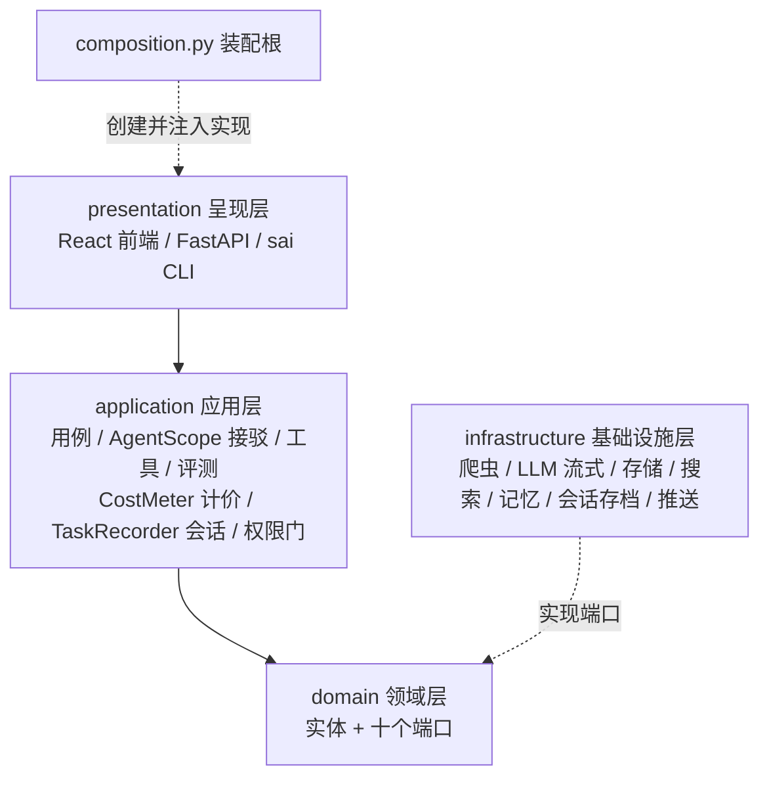
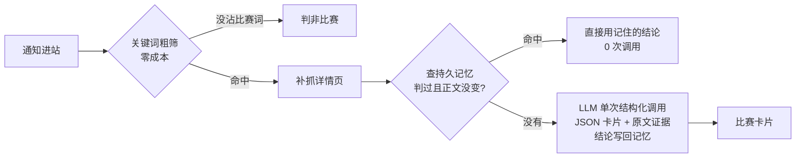

<div align="center">

# 🏆 Contest Agent

**比赛 Agent 助手 —— 自动盯官网、识别比赛、沉淀参赛卡片，为每个比赛准备参赛材料**

[](https://www.python.org/)
[](https://fastapi.tiangolo.com/)
[](https://github.com/agentscope-ai/agentscope)
[]
[](https://docs.pytest.org/)
[](LICENSE)
[](#-参与贡献)

*一个面向学生个人的比赛情报 Agent：自动盯学院官网，把混在通知里的比赛挑出来、提取成结构化卡片，生成 PPT 大纲、参赛计划书、备考学习路径——发现新比赛主动推送（webhook/邮件/文件），全程成本可查（`sai cost`）、轨迹可回放（`sai replay`）、质量有评测把关（`sai eval`）。*

**[功能特性](#-功能特性) · [快速开始](#-快速开始) · [架构设计](#-架构设计) · [路线图](#-路线图) · [Agent 层选型历程](#-agent-层的选型历程adr-001--adr-002)**

</div>

---

## ✨ 功能特性

| | 功能 | 状态 |
| :-: | --- | :-: |
| 🕷️ | **自动盯官网**：爬取学院官网通知公告，限速礼貌、逐条容错、选择器全配置化 | ✅ v0.1 |
| 🧠 | **LLM 识别比赛**：关键词粗筛 + 单次结构化调用，杂事零成本挡下 | ✅ v0.1 |
| 📇 | **结构化比赛卡片**：名称 / 类型 / 截止日期，附**逐字原文证据**防幻觉 | ✅ v0.1 |
| 📝 | **材料生成**：按 Skill 生成 PPT 大纲 / 计划书（AgentScope ReAct 循环） | ✅ v0.1 |
| 📚 | **学习路径**：考试型比赛生成强制真实引用的备考路径（联网搜索 + 引用校验） | ✅ v0.1 |
| 💰 | **成本台账**：每次调用记 token/费用，`sai cost` 回答"花了多少钱"；预算闸门超限熔断；按任务路由模型（粗活便宜模型、重活强模型），台账可证 | ✅ v2/M1 |
| 🗜️ | **上下文管理**：超阈值自动压缩（结构化摘要）+ 工具结果统一截断，长任务不撑爆窗口 | ✅ v2/M1 |
| ♻️ | **持久记忆**：判过的通知直接命中记忆、跳过 LLM——**二次扫描 0 次调用**；正文变了自动重判 | ✅ v2/M2 |
| 📼 | **会话存档**：每次任务的完整轨迹（每轮模型调用 / 工具 / 结果）可回放 `sai replay` | ✅ v2/M2 |
| 📊 | **评测套件**：31 条真实历史通知考卷 + 基线回归比对，改提示词后防退化（真跑 100% 准确率） | ✅ v2/M2 |
| ⏰ | **定时推送**：`sai watch` 盯一次官网、发现新比赛推 webhook/邮件/文件；cron 一行接入自动值班 | ✅ v2/M3 |
| 🧞 | **研究分身**：study-path 内置子代理工具，搜索+精读+压缩一步完成，主循环只收千字摘要 | ✅ v2/M3 |
| 🚪 | **权限门**：配置驱动——交互模式敏感工具先确认、无人值守按名单禁用（对照沙箱学派的取舍见文档） | ✅ v2/M3 |
| 🖥️ | **Web 界面**：复刻 Claude Desktop 的三视图 + Settings（亮暗主题/字号真切换）；Overview 六统计与热力图接真实台账；自由对话逐字流式；会话列表即轨迹回放 | ✅ v2/M4 |
| 🔌 | **端口化架构**：爬虫 / LLM / 存储 / 搜索 / 记忆 / 会话存档全部面向接口，换实现只改装配根 | ✅ 持续 |
| 🧪 | **三层测试**：99 项离线（不联网不花钱）+ 4 项显式联网验收 | ✅ 持续 |

## 🚀 快速开始

```bash
# 1. 克隆并安装（需要 uv：https://docs.astral.sh/uv/）
git clone git@github.com:Baicaicn23/contest-agent.git
cd contest-agent
uv sync

# 2. 配置密钥（DeepSeek 平台申请，文件已被 .gitignore 保护）
cp .env.example .env   # 填入 DEEPSEEK_API_KEY

# 3. 跑起来
uv run sai scan                  # 扫描学院官网最新通知
uv run sai identify              # 识别比赛：输出带原文证据的卡片
uv run sai report                # 把库里的卡片渲染成 Markdown 情报报告
uv run sai generate --skill ppt-outline   # 为最新比赛生成 PPT 大纲（ReAct 循环）
uv run sai generate --skill proposal      # 生成参赛计划书
uv run sai study-path --competition CSP   # 生成备考路径（联网搜索 + 引用校验）
uv run sai cost --today          # 查 LLM 花费账单（按任务/模型/日期）
uv run sai memory                # 查看持久记忆（识别结论缓存，sai memory clear 清空）
uv run sai sessions && uv run sai replay 1   # 任务会话列表 + 回放一次任务的完整轨迹
uv run sai eval                  # 识别能力评测（31 条真实考卷 + 基线防退化比对）
uv run sai watch                 # 盯一次官网，新比赛推 webhook/邮件/文件（cron 接管定时）

# Web 界面（可选）：构建前端后 sai serve 单端口直达
cd frontend && npm install && npm run build
uv run sai serve                 # http://127.0.0.1:8000 即是界面 + API
uv run pytest                    # 跑测试（联网验收另跑 uv run pytest -m live）
```

<details>
<summary>📦 API 一览（<code>uv run sai serve</code> 后可用）</summary>

| 方法 | 路径 | 作用 |
| --- | --- | --- |
| GET | `/health` | 健康检查 |
| POST | `/scan` | 扫描官网通知（body: `{"limit": 10}`） |
| GET | `/competitions` | 查询已识别的比赛卡片 |
| GET | `/report` | Markdown 情报报告 |
| GET | `/cost` | LLM 成本账单（可选 `?task=identify&date=2026-09-30`） |
| GET | `/sessions` / `/sessions/{id}` | 任务会话列表 / 一次任务的完整轨迹回放 |
| POST | `/generate` | 生成参赛材料（body: `{"skill": "ppt-outline"}`，需密钥，耗时 30-90s） |
| POST | `/study-path` | 生成备考路径（body: `{"competition": "CCF"}`，需密钥，耗时 40-90s） |

密钥未配置时，LLM 相关接口返回 503 + 配置指引，其余接口照常可用。

<details>
<summary>📦 Web 界面一览（构建前端后 <code>uv run sai serve</code> 可用）</summary>

| 视图 | 内容 |
| --- | --- |
| 工作台 | 问候语 + Overview 六统计（会话/消息/token/活跃天/高峰时段/常用模型）+ 18 周热力图 + 模型用量表——全部来自真实成本台账 |
| 情报站 | 大字问候 + 居中输入卡 + 快捷点子（识别/生成/备考/账单一键执行） |
| 会话 | 自由对话（逐字流式）+ 历史任务轨迹回放（工具调用折叠块） |
| Settings | 亮暗主题/字号真切换；切模型档案、改预算（写回 config.yaml）；只读路由/权限/推送 |
| 命令 | 输入框敲 `/`：/识别 /扫描 /生成 /备考 /账单 /报告 |

</details>

</details>

<details>
<summary>📦 命令一览</summary>

| 命令 | 作用 |
| --- | --- |
| `sai scan [--limit N] [--detail 序号]` | 扫描通知列表，可选打印某条详情正文 |
| `sai identify [--limit N]` | 关键词粗筛 + LLM 识别，输出比赛卡片与拒绝理由 |
| `sai cost [--task 名] [--today / --date 日期]` | 查成本台账：每次 LLM 调用的 token 与费用，按任务/模型汇总 |
| `sai memory [list / clear]` | 查看 / 清空持久记忆（识别结论缓存：判过的通知不再花钱重判） |
| `sai sessions` / `sai replay 编号` | 列出任务会话 / 回放一次任务的完整轨迹 |
| `sai eval [--save] [--limit N]` | 识别能力评测：31 条真实考卷 + 基线防退化比对（改提示词必跑） |
| `sai watch [--limit N] [--no-push] [--loop]` | 盯一次官网：识别 + 新比赛推送；cron/launchd 接管定时（`--loop` 可临时值守） |
| `sai model` / `sai model use <档案>` | 查看 / 切换模型档案（写回 config.yaml），含按任务路由表与单价 |
| `sai serve [--port 8000]` | 启动 FastAPI 服务 |

</details>

## 🏗️ 架构设计

DDD 洋葱四层 + 装配根，依赖只能从外向内；所有外部能力（爬虫、LLM、存储、搜索）都实现 `domain/ports.py` 里的端口接口——**换实现只动 `composition.py` 一个文件**。Agent 循环由 [AgentScope](https://github.com/agentscope-ai/agentscope) 驱动（ADR-002）。



每个 LLM 任务自动带上四件横切装备（装配根注入，用例无感）：**CostMeter** 记账+预算熔断、**TaskRecorder** 轨迹存档、**ContextConfig** 上下文压缩、**PermissionGate** 工具权限门（ADR-003 + M3）。

识别比赛的三级流水线 + 记忆缓存（**10 条通知通常只花 2-3 次 LLM 调用，重复扫描 0 次**）：



<details>
<summary>📁 目录结构</summary>

```
src/contest_agent/
├── domain/            # 实体 + 九个端口（洋葱芯，零外部依赖）
├── application/       # 用例（识别/生成/路径/盯梢/评测）+ AgentScope 接驳层
│                      # + cost.py 计价 + recorder.py 会话记录 + permission_gate.py 权限门
├── infrastructure/    # 爬虫 / LLM / 存储 / 搜索 / 记忆 / 会话存档 / 推送（实现端口）
├── presentation/      # FastAPI server（API + 前端托管） + sai CLI 薄壳
├── composition.py     # 装配根：唯一知道具体实现的地方
└── settings.py        # 环境优先配置（env > config.yaml > 默认值）
frontend/              # React 18 + Vite：复刻 Claude Desktop 的 Web 界面
config.yaml            # 站点源 + 选择器 + 模型档案 + 推送通道 + 权限门名单
skills/                # 技能文件（PPT 大纲 / 计划书 / 备考路径）
tests/fixtures/        # 真实页面样本 + eval_identify.json 评测考卷（31 条真实通知）
docs/adr/              # 架构决策记录（ADR-001/002/003）
```

</details>

## 🗺️ 路线图

- [x] **P0** 工程骨架：洋葱四层 + 装配根 + 环境优先配置
- [x] **P1** 爬虫：真实站点接入、选择器配置化、限速容错
- [x] **P2** 识别提取：粗筛 + 结构化调用 + 原文证据防幻觉
- [x] **P3** 存储报告：SQLAlchemy 落库、幂等去重、Markdown 报告
- [x] **P4** 手写 harness：ReAct 循环 + 工具注册 + Skill 生成参赛材料
- [x] **P5** 学习路径：考试型比赛备考路径（强制真实引用校验）
- [x] **P6** 发布闭环：完整 API、回归测试、tag v0.1.0
- [x] **v2/M1** 成本台账（`sai cost`）+ 预算闸门 + 模型路由 + 上下文压缩（ADR-003）
- [x] **v2/M2** 持久记忆（二次扫描 0 调用）+ 会话存档回放 + 评测套件（基线防退化）
- [x] **v2/M3** 定时推送（cron + 三通道）+ 研究分身（子代理摘要）+ 权限门
- [x] **v2/M4** Web 界面：复刻 Claude Desktop 三视图 + SSE 流式对话 + 真实台账面板
- [ ] **v2/M4+** 前端深化（python-pptx 真实文件 / 会话内嵌识别结果 / 多轮上下文压缩）+ 多校源 + 性能优化

## 🎓 这也是一个学习项目

本项目同时是一份"怎么从零做一个 Agent 工具"的完整教材：每个阶段完成后都会写一篇讲解文档（含设计取舍、踩坑记录、动手练习），重大决策有正式 ADR。全部讲解见 Obsidian 笔记库 `notes/水赛codex/`。

## 🤔 Agent 层的选型历程（ADR-001 → ADR-002）

这个项目在一天之内经历了完整的选型闭环，两篇 ADR 都保留了：**[ADR-001](docs/adr/ADR-001-agent层自研手写harness.md)** 决定手写循环（框架承载量分析、TS harness 包装路线的四笔成本账、尽调三问），并按此实现了完整可用的手写 ReAct 循环；**[ADR-002](docs/adr/ADR-002-采纳AgentScope驱动循环.md)** 在手写版验收通过后改采 AgentScope——迁移实测半天（工具函数与业务层零改动），验证了端口架构的回退承诺。手写版实现在 git 历史，讲解文档保留了两个版本的对照教学。

## 🤝 参与贡献

欢迎 Issue 和 PR。提交信息遵循 [Conventional Commits](https://www.conventionalcommits.org/zh-hans/)；提交前请跑 `uv run pytest`（离线测试不花钱、不联网）。

## 📄 License

[MIT](LICENSE)
