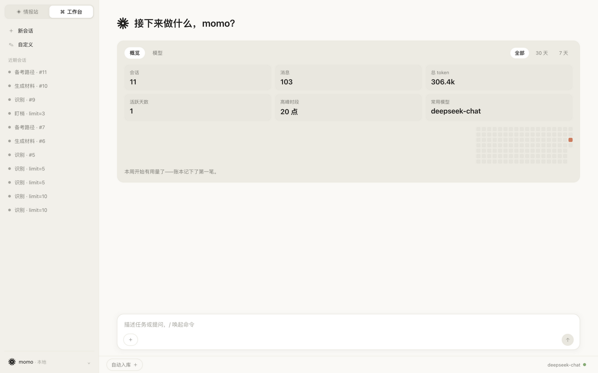
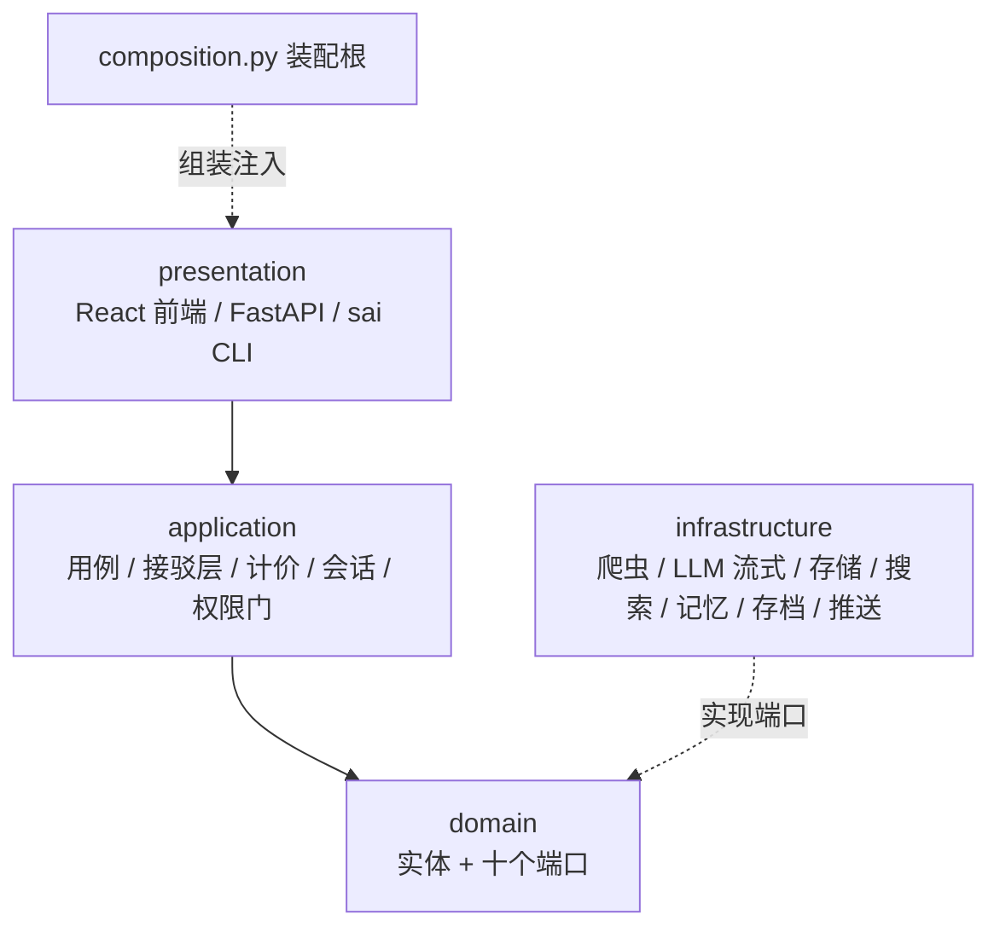

<div align="center">

# 🏆 Contest Agent

**盯学院官网 → AI 挑出比赛 → 生成参赛材料 → 新比赛主动推送**

[](https://www.python.org/)
[](https://fastapi.tiangolo.com/)
[](https://react.dev/)
[](https://docs.pytest.org/)
[](LICENSE)



**[快速开始](#-快速开始) · [它能干什么](#-它能干什么) · [Web 界面](#-web-界面) · [架构](#架构) · [路线图](#-路线图)**

</div>

---

## 🚀 快速开始

```bash
git clone git@github.com:Baicaicn23/contest-agent.git
cd contest-agent
cp .env.example .env        # 填入 DEEPSEEK_API_KEY（DeepSeek 平台申请）

./start.sh                  # 一键启动：自动构建前端 → http://127.0.0.1:8000
```

> [!TIP]
> 没装 Node.js 也能跑：`uv run sai serve` 启动纯 API 模式，用 `sai` 命令行操作全部功能。

```bash
uv run sai identify         # 识别最新通知：AI 挑出比赛，输出带原文证据的卡片
uv run sai cost --today     # 今天花了多少钱（每次调用都记账）
uv run pytest               # 133 项测试，离线不花钱
```

## ✨ 它能干什么

- 🕷️ **盯官网**：爬学院通知公告，限速礼貌、选择器全配置化
- 🧠 **识比赛**：关键词粗筛 + LLM 单次结构化调用，卡片附**逐字原文证据**防幻觉
- 📝 **出材料**：生成 PPT 大纲并直接导出 **.pptx 文件**、参赛计划书、带真实引用的备考路径
- 💰 **管成本**：每次 LLM 调用记 token 与费用，预算超限自动熔断，按任务路由便宜/昂贵模型
- ♻️ **有记性**：判过的通知直接命中记忆——二次扫描 0 次调用；31 条真实考卷防识别质量退化
- ⏰ **会值班**：`sai watch` + cron 定时盯官网，新比赛推 webhook / 邮件 / 文件；
  截止守望 **T-7/3/1/0 四档倒计时警报**，过期自动停报——别的 agent 不会每天替你看截止日期
- 🖥️ **Web 界面**：复刻 Claude Desktop 的三视图——真实台账面板、逐字流式对话、
  轨迹回放、亮暗主题；**聊天即行动**：对话背后是真 agent，会自己扫官网、查卡片、给简报

<details>
<summary>📦 全部命令与 API（点开）</summary>

| 命令 | 作用 |
| --- | --- |
| `sai identify [--limit N]` | 粗筛 + LLM 识别，输出比赛卡片与拒绝理由 |
| `sai generate --skill ppt-outline` | 生成大纲并导出 .pptx（ReAct 循环） |
| `sai study-path --competition CSP` | 备考路径（联网搜索 + 引用校验） |
| `sai watch` | 盯一次官网，新比赛推送（cron 接管定时） |
| `sai cost [--task 名] [--today]` | 成本台账：按任务/模型/日期汇总 |
| `sai memory` / `sai sessions` / `sai replay 编号` | 记忆查看 / 会话列表 / 轨迹回放 |
| `sai eval` | 31 条真实考卷评测，防识别质量退化 |
| `sai deadlines` | 列出未来 30 天内截止的比赛（T-7/3/1/0 四档提醒由 watch 自动推送） |
| `sai serve` | 启动 Web 界面 + API |

HTTP 接口：`/health` `/scan` `/identify` `/competitions` `/report` `/cost` `/sessions/{id}` `/generate` `/study-path` `/api/chat`（SSE）`/api/usage/summary` `/api/config` `/api/deadlines`

</details>

## 🖥️ Web 界面

构建前端后 `./start.sh` 或 `uv run sai serve`，浏览器打开即是完整界面：**工作台**（Overview 六统计 + 18 周热力图，全部来自真实成本台账）、**情报站**（大字问候 + 一键点子）、**会话**（逐字流式对话 + 任务轨迹回放）、**Settings**（亮暗主题、字号、切模型档案、改预算——真实写回 config.yaml）。输入框敲 `/` 唤起命令面板。界面按桌面级标准打磨：悬浮式侧栏（圆角 + 阴影 + 留白）、全部按钮带 hover/按压/键盘焦点四态反馈、视图与弹层均有衔接动画（系统开启"减弱动态效果"时自动禁用）、关闭钮统一左上 + Esc 全覆盖。

## 架构

DDD 洋葱四层 + 装配根：所有外部能力实现 `domain/ports.py` 里的端口（爬虫 / LLM / 存储 / 搜索 / 记忆 / 会话存档 / 推送 / 流式对话），**换实现只改 `composition.py`**。Agent 循环由 [AgentScope](https://github.com/agentscope-ai/agentscope) 驱动。



<details>
<summary>📁 目录结构</summary>

```
src/contest_agent/
├── domain/            # 实体 + 十个端口（洋葱芯，零外部依赖）
├── application/       # 用例 + AgentScope 接驳 + 计价/会话记录/权限门/评测
├── infrastructure/    # 爬虫 / LLM / 存储 / 搜索 / 记忆 / 存档 / 推送
├── presentation/      # FastAPI server + sai CLI
├── composition.py     # 装配根
└── settings.py        # env > config.yaml > 默认值
frontend/              # React 18 + Vite Web 界面
skills/                # 技能文件（PPT 大纲 / 计划书 / 备考路径）
tests/fixtures/        # 真实页面样本 + 31 条评测考卷
docs/adr/              # 架构决策记录（ADR-001/002/003）
```

</details>

## 🗺️ 路线图

- [x] **v1** 完整闭环：盯官网 → 识别 → 材料/路径 → 发布（P0-P6）
- [x] **v2/M1-M3** 成本台账 + 上下文压缩 · 记忆 + 会话回放 + 评测 · 推送 + 子代理 + 权限门
- [x] **v2/M4** Web 界面（React 复刻 Claude Desktop）
- [x] **v2/M4+** 截止日期守望：T-7/3/1/0 四档倒计时警报（时间驱动的差异化方向）
- [x] **v2/M5** Codex 化界面：项目树 + 插件市场（能力开关）+ 完全访问总闸 + 设置全页
- [x] **v2/M6** 界面美化与交互升级：悬浮侧栏 + 全站四态反馈 + 衔接动画 + 关闭钮左上/Esc 全覆盖
- [x] **v2/M7** 工作台图二化：操作入口 + 项目树两级 + 右侧工具坞（文件树 + 真终端，⌘K/⌘N）
- [x] **v2/M8** 侧栏完全复刻：SVG 图标 + 项目树折叠收纳 + 运行中任务转圈 + 删除/筛选/未归类
- [x] **v2/M9** Composer 集成：上传/三档权限（只读·变更前确认·完全访问）/上下文 %/模型切换收进输入卡；首页精简
- [x] **v2/M10** 用户视角三连：消息 Markdown 渲染（表格/代码块）+ agent 读附件（PDF/文本）+ 桌面截止通知
- [ ] **下一批** python-pptx 真实文件 · 多校源 · 并行识别与抓取缓存

## 🎓 也是一个学习项目

从零走完整个开发流程的教材：每个里程碑一篇讲解文档（为什么 > 怎么做 > 踩坑），重大决策立 ADR。索引见 [`docs/开发文档-v1.md`](docs/开发文档-v1.md)。

## 🤝 贡献与许可

欢迎 Issue 和 PR（提交信息遵循 [Conventional Commits](https://www.conventionalcommits.org/zh-hans/)，提交前跑 `uv run pytest`）。License: [MIT](LICENSE)。
