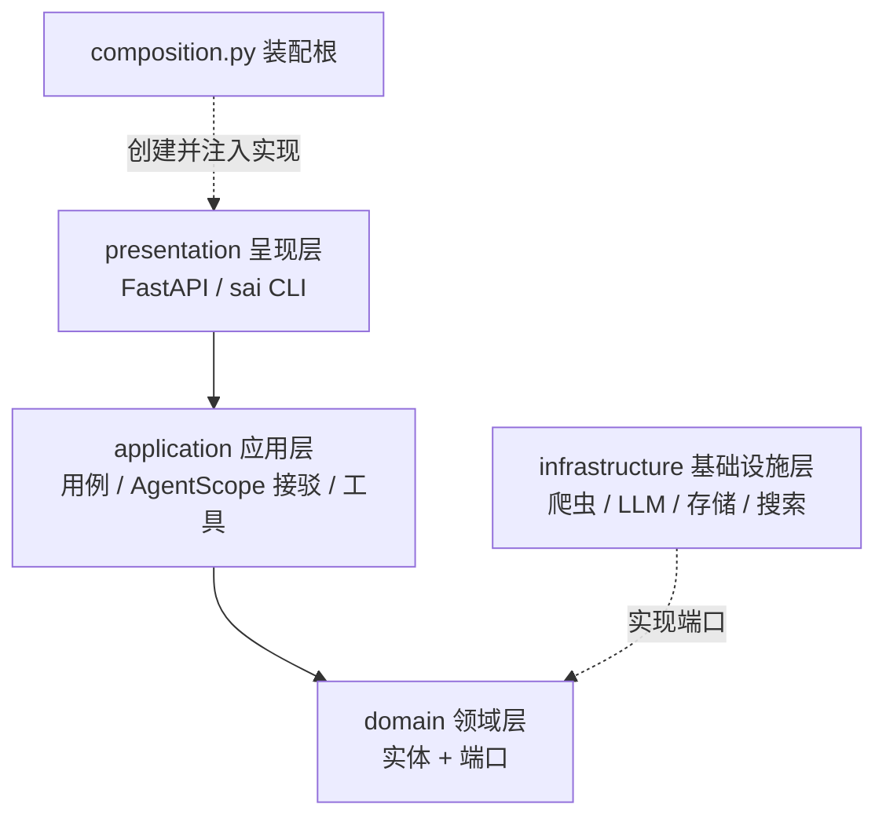
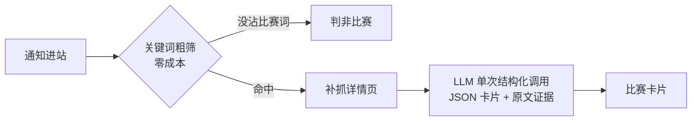

<div align="center">

# 🏆 Contest Agent

**比赛 Agent 助手 —— 自动盯官网、识别比赛、沉淀参赛卡片，为每个比赛准备参赛材料**

[](https://www.python.org/)
[](https://fastapi.tiangolo.com/)
[](https://www.deepseek.com/)
[](https://docs.pytest.org/)
[](LICENSE)
[](#-参与贡献)

*一个面向学生个人的比赛情报 Agent：盯着学院官网的通知公告，把混在里面的比赛挑出来，提取成结构化卡片，并为后续生成 PPT 大纲、计划书、学习路径打下地基。*

**[功能特性](#-功能特性) · [快速开始](#-快速开始) · [架构设计](#-架构设计) · [路线图](#-路线图) · [Agent 层选型历程](#-agent-层的选型历程adr-001--adr-002)**

</div>

---

## ✨ 功能特性

| | 功能 | 状态 |
| :-: | --- | :-: |
| 🕷️ | **自动盯官网**：定时爬取学院官网通知公告，限速礼貌、逐条容错 | ✅ v0.1 |
| 🧠 | **LLM 识别比赛**：关键词粗筛 + 单次结构化调用，杂事零成本挡下 | ✅ v0.1 |
| 📇 | **结构化比赛卡片**：名称 / 类型 / 截止日期，附**逐字原文证据**防幻觉 | ✅ v0.1 |
| 💰 | **成本控制意识**：5 条通知通常只花 1 次 LLM 调用 | ✅ v0.1 |
| 🔌 | **端口化架构**：爬虫 / LLM / 存储 / 搜索全部面向接口，换实现只改装配根 | ✅ v0.1 |
| 🧪 | **三层测试**：离线样本测试 + 假对象编排测试 + 显式联网验收 | ✅ v0.1 |
| 📝 | **材料生成**：按 Skill 生成 PPT 大纲 / 计划书 / 演讲稿（AgentScope ReAct 循环） | ✅ v0.1 |
| 📚 | **学习路径**：考试型比赛生成强制真实引用的备考路径（联网搜索 + 引用校验） | ✅ v0.1 |

## 🚀 快速开始

```bash
# 1. 克隆并安装（需要 uv：https://docs.astral.sh/uv/）
git clone git@github.com:Baicaicn23/contest-agent.git
cd contest-agent
uv sync

# 2. 配置密钥（DeepSeek 平台申请，文件已被 .gitignore 保护）
cp .env.example .env   # 填入 DEEPSEEK_API_KEY

# 3. 跑起来
uv run sai scan                  # 扫描学院官网最新通知
uv run sai identify              # 识别比赛：输出带原文证据的卡片
uv run sai report                # 把库里的卡片渲染成 Markdown 情报报告
uv run sai generate --skill ppt-outline   # 为最新比赛生成 PPT 大纲（ReAct 循环）
uv run sai generate --skill proposal      # 生成参赛计划书
uv run sai study-path --competition CSP   # 生成备考路径（联网搜索 + 引用校验）
uv run sai serve                 # 启动 API 服务，访问 /health
uv run pytest                    # 跑测试（联网验收另跑 uv run pytest -m live）
```

<details>
<summary>📦 API 一览（<code>uv run sai serve</code> 后可用）</summary>

| 方法 | 路径 | 作用 |
| --- | --- | --- |
| GET | `/health` | 健康检查 |
| POST | `/scan` | 扫描官网通知（body: `{"limit": 10}`） |
| GET | `/competitions` | 查询已识别的比赛卡片 |
| GET | `/report` | Markdown 情报报告 |
| POST | `/generate` | 生成参赛材料（body: `{"skill": "ppt-outline"}`，需密钥，耗时 30-90s） |
| POST | `/study-path` | 生成备考路径（body: `{"competition": "CCF"}`，需密钥，耗时 40-90s） |

密钥未配置时，LLM 相关接口返回 503 + 配置指引，其余接口照常可用。

</details>

<details>
<summary>📦 命令一览</summary>

| 命令 | 作用 |
| --- | --- |
| `sai scan [--limit N] [--detail 序号]` | 扫描通知列表，可选打印某条详情正文 |
| `sai identify [--limit N]` | 关键词粗筛 + LLM 识别，输出比赛卡片与拒绝理由 |
| `sai model` / `sai model use <档案>` | 查看 / 切换模型档案（写回 config.yaml） |
| `sai serve [--port 8000]` | 启动 FastAPI 服务 |

</details>

## 🏗️ 架构设计

DDD 洋葱四层 + 装配根，依赖只能从外向内；所有外部能力（爬虫、LLM、存储、搜索）都实现 `domain/ports.py` 里的端口接口——**换实现只动 `composition.py` 一个文件**。Agent 循环由 [AgentScope](https://github.com/agentscope-ai/agentscope) 驱动（ADR-002）。



识别比赛的三级流水线（**5 条通知通常只花 1 次 LLM 调用**）：



<details>
<summary>📁 目录结构</summary>

```
src/contest_agent/
├── domain/            # 实体 + 四个端口（洋葱芯，零外部依赖）
├── application/       # 用例 + AgentScope 接驳层 + 关键词粗筛 + 提示词
├── infrastructure/    # 爬虫 / LLM / 存储 / 搜索（实现端口）
├── presentation/      # FastAPI server + sai CLI 薄壳
├── composition.py     # 装配根：唯一知道具体实现的地方
└── settings.py        # 环境优先配置（env > config.yaml > 默认值）
config.yaml            # 站点源 + CSS 选择器 + 模型档案（全配置化）
tests/fixtures/        # 真实页面样本：解析器离线可测
docs/adr/              # 架构决策记录
```

</details>

## 🗺️ 路线图

- [x] **P0** 工程骨架：洋葱四层 + 装配根 + 环境优先配置
- [x] **P1** 爬虫：真实站点接入、选择器配置化、限速容错
- [x] **P2** 识别提取：粗筛 + 结构化调用 + 原文证据防幻觉
- [x] **P3** 存储报告：SQLAlchemy 落库、幂等去重、Markdown 报告
- [x] **P4** 手写 harness：ReAct 循环 + 工具注册 + Skill 生成参赛材料
- [x] **P5** 学习路径：考试型比赛备考路径（强制真实引用校验）
- [x] **P6** 发布闭环：完整 API、回归测试、tag v0.1.0
- [ ] **v2** 上下文管理 / 记忆 / 成本台账 / 评测套件 / 多校源

## 🎓 这也是一个学习项目

本项目同时是一份"怎么从零做一个 Agent 工具"的完整教材：每个阶段完成后都会写一篇讲解文档（含设计取舍、踩坑记录、动手练习），重大决策有正式 ADR。全部讲解见 Obsidian 笔记库 `notes/水赛codex/`。

## 🤔 Agent 层的选型历程（ADR-001 → ADR-002）

这个项目在一天之内经历了完整的选型闭环，两篇 ADR 都保留了：**[ADR-001](docs/adr/ADR-001-agent层自研手写harness.md)** 决定手写循环（框架承载量分析、TS harness 包装路线的四笔成本账、尽调三问），并按此实现了完整可用的手写 ReAct 循环；**[ADR-002](docs/adr/ADR-002-采纳AgentScope驱动循环.md)** 在手写版验收通过后改采 AgentScope——迁移实测半天（工具函数与业务层零改动），验证了端口架构的回退承诺。手写版实现在 git 历史，讲解文档保留了两个版本的对照教学。

## 🤝 参与贡献

欢迎 Issue 和 PR。提交信息遵循 [Conventional Commits](https://www.conventionalcommits.org/zh-hans/)；提交前请跑 `uv run pytest`（离线测试不花钱、不联网）。

## 📄 License

[MIT](LICENSE)
